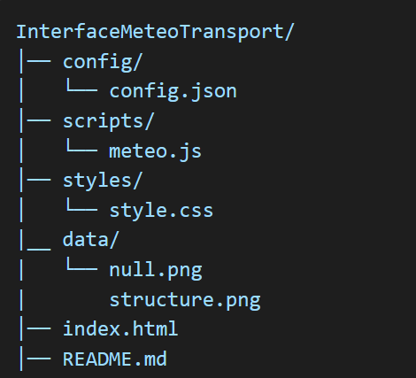

# Projet Météo avec l'API OpenWeatherMap 
## Auteur : Yousra Chbib

### Description : 

Ce projet est une application web qui affiche les données météo d'une ville en temps réel en utilisant l'API OpenWeatherMap. Il met à jour automatiquement les informations toutes les heures.

### Fonctionnalités :

1. Affichage du nom de la ville.
2. Température actuelle en degrés Celsius (°C).
3. Description des conditions météorologique.
4. Icône météo associée aux conditions actuelles.
5. Niveau d'humidité.
6. Vitesse du vent en km/h.

### Technologies Utilisées :

- HTML
- CSS
- JavaScript
- API OpenWeatherMap

### Installation

#### Clonage du dépôt :

`git clone https://github.com/Yousra0225/InterfaceMeteoTransport.git`

#### Structure du projet : 

#### Utilisation d'un serveur local

J'ai installé l'extension "Live Server" du VS-Code et ouvrer le fichier index.html avec.